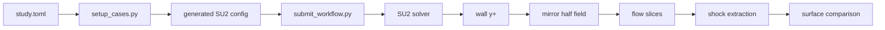
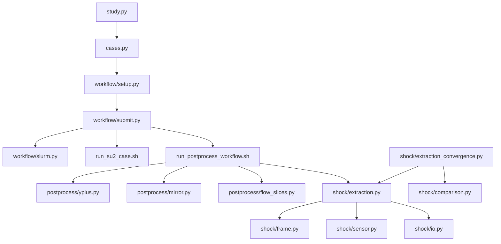

# Hypersonics CFD System Tutorial

## 1. Mental Model

The repository has four layers:

```text
study.toml
    |
    v
case setup -> SLURM workflow -> case data -> analysis
```

| Layer | Purpose |
|---|---|
| `studies/orion/study.toml` | Defines cases, meshes, solver settings, boundary conditions, walltimes, exclusions, aliases, and overrides. |
| `scripts/` | Contains the commands a user runs. Each Python command only loads the package and calls one `main()` function. |
| `src/hypersonics_cfd/` | Contains the workflow and scientific implementation. |
| `studies/orion/data/` | Contains solver results and derived files. |

The scripts are intentionally thin. For example:

```python
import _bootstrap
from hypersonics_cfd.shock.extraction import main
main()
```

This means there is one implementation of each operation. The script is only
its command-line name.

## 2. Repository Layout

```text
hypersonics-cfd/
├── scripts/
│   ├── setup_cases.py
│   ├── submit_workflow.py
│   ├── workflow_status.py
│   ├── check_convergence.py
│   ├── mirror_sym_flow.py
│   ├── export_flow_slices.py
│   ├── extract_yplus_surface.py
│   ├── extract_shock_surface.py
│   ├── export_initial_search_line.py
│   ├── compare_shock_surfaces.py
│   ├── shock_extraction_convergence.py
│   ├── workflow_timing.py
│   └── pull_cluster_results.sh
├── src/hypersonics_cfd/
│   ├── study.py
│   ├── cases.py
│   ├── workflow/
│   ├── postprocess/
│   └── shock/
├── studies/orion/
│   ├── study.toml
│   ├── geometry/
│   ├── meshes/
│   ├── build/generated-configs/
│   ├── data/cases/
│   └── analysis/
├── templates/
│   ├── su2/
│   └── slurm/
└── tests/
```

Only the commands shown above are active. `scripts/obsolete/` contains retired
one-off tools and is not imported or called by the managed workflow.

## 3. Case Names and Aliases

The Orion study generates two groups.

### Angle-of-attack sweep

```text
m1p5_aoa0
m1p5_aoa15
...
m9_aoa60
```

These cases use the `very_fine` symmetric mesh.

### Mesh-refinement study

```text
m3_coarse
m3_medium
m3_fine
m3_very_fine
```

The very-fine zero-angle case is already part of the angle-of-attack sweep.
The following names are therefore aliases:

```text
m1p5_very_fine -> m1p5_aoa0
m3_very_fine   -> m3_aoa0
m6_very_fine   -> m6_aoa0
m9_very_fine   -> m9_aoa0
```

An alias is a symlink, not another simulation. It prevents the same very-fine
case from being solved twice.

## 4. Complete Case Lifecycle



The full managed chain is:

```text
solver
  -> yplus
  -> mirror
  -> slices
  -> shock
```

Each arrow is a SLURM `afterok` dependency. A downstream job begins only after
the upstream job exits successfully.

## 5. Command Reference

| Command | Implementation | Purpose |
|---|---|---|
| `setup_cases.py` | `workflow/setup.py` | Expands `study.toml` and renders SU2 configs. |
| `submit_workflow.py` | `workflow/submit.py` | Dry-runs or submits solver and post-processing jobs. |
| `workflow_status.py` | `workflow/status.py` | Shows solver, y+, mirror, slice, shock, queue, and timing status. |
| `workflow_timing.py` | `workflow/timing.py` | Records one completed workflow step. Called by SLURM templates. |
| `check_convergence.py` | `postprocess/solver_convergence.py` | Checks the final SU2 residual row. |
| `mirror_sym_flow.py` | `postprocess/mirror.py` | Mirrors a symmetric half-domain flow field. |
| `export_flow_slices.py` | `postprocess/flow_slices.py` | Writes the `xy` and `xz` ParaView slices. |
| `extract_yplus_surface.py` | `postprocess/yplus.py` | Writes the full Orion wall surface and y+ statistics. |
| `extract_shock_surface.py` | `shock/extraction.py` | Extracts a triangulated shock surface. |
| `export_initial_search_line.py` | `shock/diagnostics.py` | Exports the initial stagnation-line sensor profile. |
| `compare_shock_surfaces.py` | `shock/comparison.py` | Compares adjacent refinement shock surfaces. |
| `shock_extraction_convergence.py` | `shock/extraction_convergence.py` | Varies shock-extractor `dt` and `dn` on one fixed flow field. |
| `pull_cluster_results.sh` | Shell only | Copies selected case files from the cluster. |

## 6. Case Setup

Run:

```bash
python3 scripts/setup_cases.py
```

The setup module:

1. Reads `studies/orion/study.toml`.
2. Expands the Mach/AoA sweep.
3. Expands the mesh-refinement cases.
4. Removes cases listed under `generation.exclude_cases`.
5. Applies Mach profiles.
6. Applies override blocks from top to bottom.
7. Resolves each mesh path.
8. Inserts the symmetric boundary-condition block.
9. Renders `templates/su2/config.cfg.template`.
10. Writes `studies/orion/build/generated-configs/<case>.cfg`.
11. Creates the very-fine alias symlinks.

The generated config is the exact SU2 input used by the solver job.

### Where settings come from

The final value order is:

```text
defaults
  -> Mach profile
  -> generated case values
  -> matching overrides
```

An override lower in `study.toml` wins over an earlier value.

## 7. Submitting the Workflow

Preview a complete workflow:

```bash
python3 scripts/submit_workflow.py \
    --dry-run \
    --cases m3_aoa0,m3_aoa15 \
    --full-workflow
```

Submit it:

```bash
python3 scripts/submit_workflow.py \
    --submit \
    --cases m3_aoa0,m3_aoa15 \
    --full-workflow
```

Submit only selected stages:

```bash
python3 scripts/submit_workflow.py \
    --submit \
    --cases m3_medium \
    --mirror \
    --slices \
    --shock
```

### What the submitter does

For every selected case, it:

1. Loads and stages the generated config.
2. Checks which requested outputs already exist.
3. Builds the solver `sbatch` command.
4. Builds one post-processing `sbatch` command per selected step.
5. Gives each step its mesh-specific walltime from `study.toml`.
6. Adds the upstream job ID as an `afterok` dependency.
7. Prints the commands in dry-run mode or submits them in submit mode.

### Restarting or rerunning

Solver restart behavior comes from `restart_sol` in `study.toml`. Set it in an
override for the cases being continued.

Useful submission flags:

| Flag | Meaning |
|---|---|
| `--resubmit-existing` | Submit the solver even when solver outputs exist. |
| `--rerun-postprocess` | Submit selected post-processing steps even when their outputs exist. |
| `--overwrite-mirror` | Replace an existing full mirrored field. |

The post-processing template checks output freshness. A completed output newer
than its input is skipped unless rerunning is requested.

## 8. Workflow Status and Timings

Run:

```bash
python3 scripts/workflow_status.py
```

For selected cases:

```bash
python3 scripts/workflow_status.py \
    --cases m1p5_medium,m1p5_fine,m1p5_aoa0
```

The table combines:

- output-file presence and timestamps;
- the latest solver log;
- matching jobs in `squeue`;
- the latest timing row for each step.

The SLURM templates call `workflow_timing.py` automatically. Timings are
appended to:

```text
studies/orion/data/cases/<case>/logs/workflow_timings.csv
studies/orion/data/workflow_timings.csv
```

`workflow_timing.py` is an internal command. It normally should not be run by
hand.

## 9. Files in One Case Folder

```text
data/cases/m3_aoa15/
├── history.csv
├── restart_flow.dat
├── flow.vtu
├── surface_flow.vtu
├── orion_yplus.vtp
├── yplus_summary.csv
├── flow_full.vtu
├── flow_slice_xy.vtp
├── flow_slice_xz.vtp
├── shock_surface.csv
├── shock_surface.vtp
└── logs/
    ├── solver/
    ├── postprocess/
    └── workflow_timings.csv
```

| File | Meaning |
|---|---|
| `history.csv` | SU2 convergence history. |
| `restart_flow.dat` | SU2 restart solution. |
| `flow.vtu` | Symmetric half-domain volume field. |
| `surface_flow.vtu` | Orion wall solution from SU2. |
| `orion_yplus.vtp` | Full mirrored Orion wall with y+. |
| `yplus_summary.csv` | Area-weighted y+ statistics. |
| `flow_full.vtu` | Full volume field reconstructed from the half field. |
| `flow_slice_xy.vtp` | Flow slice in the AoA plane. |
| `flow_slice_xz.vtp` | Flow slice just off the symmetry interface. |
| `shock_surface.csv` | Extracted shock points and metadata. |
| `shock_surface.vtp` | Triangulated shock surface for ParaView. |

## 10. Mirroring the Symmetric Field

Run manually:

```bash
python3 scripts/mirror_sym_flow.py \
    studies/orion/data/cases/m3_aoa15
```

The mirror module:

1. Reads `flow.vtu`.
2. Copies the mesh.
3. Reflects point coordinates across global `y=0`.
4. Reverses the `y` component of every three-component vector array.
5. Merges the original and reflected meshes.
6. Writes `flow_full.vtu`.

Scalar fields are copied unchanged. Vector components normal to the symmetry
plane must change sign.

## 11. Flow Slices

Run:

```bash
CFD_STUDY=orion \
CFD_CASE=m3_aoa15 \
python3 scripts/export_flow_slices.py
```

The script reads `flow_full.vtu` and writes:

```text
flow_slice_xy.vtp
flow_slice_xz.vtp
```

The `xz` slice is offset from `y=0` by `1e-9 m`. Sampling exactly on the
interface of the two mirrored meshes can expose an artificial internal seam.

## 12. Wall y+

Run:

```bash
python3 scripts/extract_yplus_surface.py \
    --study orion \
    --cases m6_aoa0
```

The y+ module:

1. Uses a current `surface_flow.vtu` when it contains y+.
2. Otherwise runs `SU2_SOL` from `restart_flow.dat` with
   `MARKER_PLOTTING=(ORION_SURFACE)`.
3. Mirrors the half-body wall surface.
4. Computes cell areas.
5. Computes area-weighted mean, median, p95, and p99 y+.
6. Writes `orion_yplus.vtp` and `yplus_summary.csv`.

The VTP is the actual Orion wall geometry with y+ attached, not only a table of
statistics.

## 13. Solver Residual Convergence

Run:

```bash
python3 scripts/check_convergence.py
```

This is solver convergence, not mesh convergence and not shock-extraction
convergence.

The script:

1. Reads the last row of each selected `history.csv`.
2. Selects columns beginning with `rms[`.
3. Compares their stored base-10 logarithms with the requested threshold.
4. Prints `PASS` or the residuals that remain above the threshold.

SU2 itself uses the convergence settings rendered from `study.toml`, including
`conv_residual_minval` and `conv_startiter`.

## 14. Shock Extraction

Run:

```bash
CFD_STUDY=orion \
CFD_CASE=m6_aoa40 \
python3 scripts/extract_shock_surface.py
```

The main implementation is split into:

| Module | Responsibility |
|---|---|
| `shock/frame.py` | Body-fixed coordinates and AoA basis. |
| `shock/sensor.py` | Search-line smoothing and peak selection. |
| `shock/extraction.py` | Flow differentiation and panel marching. |
| `shock/io.py` | VTP and CSV output. |

### 14.1 Build the shock sensor

The extractor reads `flow_full.vtu` and asks VTK to differentiate density:

$$
\nabla\rho =
\left[
\frac{\partial\rho}{\partial x},
\frac{\partial\rho}{\partial y},
\frac{\partial\rho}{\partial z}
\right].
$$

The shock sensor is:

$$
S = |\nabla\rho|.
$$

A shock produces a strong density change, so it appears as a local maximum of
`S` along a line crossing the shock.

### 14.2 Build the body-fixed frame

The freestream direction for angle of attack `alpha` defines the streamwise
basis. Global `y` remains spanwise. The third basis direction lies in the AoA
plane.

The body anchor is the most upstream body point in the streamwise direction.
It is obtained from `surface_flow.vtu` when available and otherwise from
`geometry/orion_profile_xy.csv`.

The frame prevents high-AoA cases from searching along an axis that misses the
physical stagnation region.

### 14.3 Find the stagnation shock seed

The initial search line passes through the body anchor in the streamwise
direction.

The search has two passes:

1. Sample the full line with spacing `2*dn`.
2. Find the first upstream shock-sensor peak.
3. Center a short line on that candidate.
4. Resample the short line with spacing `0.2*dn`.
5. Use the refined peak as the stagnation shock node.

The body region downstream of the expected shock is excluded so the wall
density gradient is not mistaken for the bow shock.

There is no fixed dimensional shock threshold for this first line. Peak
detection uses:

$$
S_{\mathrm{height}}
=
0.05\,S_{\max,\mathrm{line}},
$$

and a detection prominence of:

$$
P_{\min}
=
0.02\,S_{\max,\mathrm{line}}.
$$

The first upstream peak satisfying the line-relative criteria is selected. If
no local peak is detected, the largest sampled sensor value is used.

The seed always comes from the current CFD field. The extractor does not
substitute a shock point from an older CSV result.

### 14.4 Smooth each search-line profile

The raw interpolated sensor profile is smoothed with a Savitzky-Golay filter.
The target physical smoothing length is `0.25 m`, bounded to an odd window of
9 to 31 samples with polynomial order 3.

Only the one-dimensional sampled profile is smoothed. The complete CFD flow
field is not smoothed.

### 14.5 March the surface

The stagnation seed is shell zero. The algorithm creates azimuthal rays around
the streamwise axis and advances outward by:

$$
\Delta s = dt.
$$

For the first few nodes on each ray, local streamwise search lines bootstrap
the surface.

Once a ray has enough history:

1. Fit a quadratic panel model to recent accepted nodes.
2. Predict the next shock location one `dt` step outward.
3. Orient a local search line normal to the predicted panel.
4. Sample that line with spacing `dn`.
5. Smooth the sampled sensor.
6. Detect the sensor peak nearest the line center.
7. Correct the panel using the candidate and sample once more.

The production settings are:

```text
dt = 0.10 m
dn = 0.01 m
panel polynomial degree = 2
panel history = 31 nodes
```

### 14.6 Accept a shock node

A candidate is retained based on:

- sensor strength relative to the stagnation peak;
- distance from the panel prediction;
- peak prominence farther from the nose;
- continuity with neighbouring rays;
- continuity with the previous accepted node on that ray.

The global sensor floor is:

$$
S_{\min}=0.005\,S_{\mathrm{stagnation}}.
$$

The local line still uses its own relative height and prominence criteria.

### 14.7 Terminate and triangulate

Marching stops when a new shell contains too few accepted rays to form a
reliable surface. A large shell-count limit only prevents an infinite march.

The cleanup stage keeps the main connected component and removes unsupported
dangling endpoints. Remaining neighbouring shell/ray nodes are connected into
triangles.

Outputs:

```text
shock_surface.vtp
shock_surface.csv
```

The VTP field data stores the body anchor and streamwise, normal, and spanwise
basis vectors used by the extraction.

## 15. Initial Search-Line Diagnostic

Run:

```bash
CFD_STUDY=orion \
CFD_CASE=m6_medium \
python3 scripts/export_initial_search_line.py
```

Output:

```text
initial_search_line_profile.csv
```

The CSV contains:

- coarse and refined line coordinates;
- raw and smoothed sensor values;
- valid-sample masks;
- selected peak;
- line location and spacing.

Use this when the stagnation stand-off distance changes unexpectedly between
refinement levels. It reveals whether different meshes are selecting different
sensor peaks.

## 16. Shock-Surface Mesh Convergence

Run:

```bash
python3 scripts/compare_shock_surfaces.py
```

This compares:

```text
coarse -> medium
medium -> fine
fine -> very_fine
```

It does not compare every possible pair.

### 16.1 Polar surface representation

Each surface is represented in the body-fixed frame as:

$$
R=R(\vartheta,\varphi),
$$

where:

- `R` is distance from the body anchor;
- `vartheta` is polar angle measured away from the upstream stagnation axis;
- `varphi` is azimuth around the streamwise axis.

### 16.2 Common angular support

Different extractions may march to different extents. Comparing an unmatched
outer region would measure extraction length rather than shape convergence.

For every azimuth, each surface has a maximum polar angle:

$$
\vartheta_{\max,k}(\varphi).
$$

The shared limit is the minimum of those maxima:

$$
\vartheta_{\mathrm{common}}(\varphi)
=
\min_k \vartheta_{\max,k}(\varphi).
$$

All adjacent pairs for the same Mach number use that same shared limit.

### 16.3 Radial difference

Both surfaces are interpolated onto a common
`(vartheta,varphi)` grid. At each valid direction:

$$
d(\vartheta,\varphi)
=
\left|
R_A(\vartheta,\varphi)
-
R_B(\vartheta,\varphi)
\right|.
$$

This is a directional radial difference, not a nearest-neighbour distance.

The solid-angle weight is:

$$
w=\sin(\vartheta).
$$

The reported RMS is:

$$
\frac{E_{\mathrm{RMS}}}{D}
=
\frac{1}{D}
\sqrt{
\frac{\sum wd^2}{\sum w}
},
\qquad D=5\ \mathrm{m}.
$$

The CSV also contains normalized mean, p95, maximum, shared angular extent,
and stagnation stand-off difference.

### 16.4 Stand-off distance

The shell-zero shock node gives the stagnation stand-off distance:

$$
\Delta=R(0).
$$

Its adjacent difference is reported separately:

$$
\frac{|\Delta_A-\Delta_B|}{D}.
$$

This is important because solid-angle weighting gives the single stagnation
direction almost no weight in the full-surface RMS.

Output:

```text
studies/orion/data/shock_surface_deviation_refinement.csv
```

Plot:

```matlab
plot_shock_surface_deviation
```

## 17. Shock-Extraction Convergence

Run:

```bash
python3 scripts/shock_extraction_convergence.py m6_medium
```

This is not a CFD mesh-refinement study. It holds one CFD flow field fixed and
changes only the extraction resolution.

The density gradient is calculated once. Five surfaces are then extracted:

| Setting | `dt` | `dn` |
|---|---:|---:|
| Baseline coarse-normal sampling | 0.10 m | 0.020 m |
| Production | 0.10 m | 0.010 m |
| Fine-normal sampling | 0.10 m | 0.005 m |
| Coarse marching | 0.20 m | 0.010 m |
| Fine marching | 0.05 m | 0.010 m |

The comparisons isolate one parameter at a time:

```text
dn sweep: 0.020 -> 0.010 -> 0.005 m at dt=0.10 m
dt sweep: 0.20  -> 0.10  -> 0.05 m at dn=0.01 m
```

Outputs:

```text
data/cases/m6_medium/shock_extraction_convergence/
├── dt0p05_dn0p010/
├── dt0p10_dn0p005/
├── dt0p10_dn0p010/
├── dt0p10_dn0p020/
├── dt0p20_dn0p010/
├── runs.csv
└── comparisons.csv
```

`runs.csv` contains extraction settings, stand-off, point count, triangle
count, termination, and runtime.

`comparisons.csv` contains common-polar surface differences against the finest
setting in each one-parameter sweep.

Extractor-induced changes should be much smaller than the CFD
fine-to-very-fine difference before claiming CFD mesh convergence.

## 18. Pulling Cluster Results

Pull lightweight outputs:

```bash
bash scripts/pull_cluster_results.sh \
    "m1p5_medium,m1p5_fine,m1p5_aoa0" \
    light
```

Pull only shock surfaces:

```bash
bash scripts/pull_cluster_results.sh \
    "m3_coarse,m3_medium,m3_fine,m3_aoa0" \
    shock
```

Available presets:

```text
history
flow
shock
slices
yplus
diagnostics
timing
light
all
```

Running the script without arguments lists remote cases and prompts for case
names and a preset.

Overrides:

```bash
CLUSTER_USER=anthonyy
CLUSTER_HOST=trillium
CLUSTER_CASES_DIR=/scratch/anthonyy/hypersonics-cfd/studies/orion/data/cases
LOCAL_CASES_DIR=studies/orion/data/cases
```

## 19. Module Interaction Map



## 20. Where to Make Changes

| Desired change | File |
|---|---|
| Add/remove Mach numbers or AoAs | `studies/orion/study.toml` |
| Change mesh used by a study | `studies/orion/study.toml` |
| Change boundary labels | `studies/orion/study.toml` |
| Change solver CFL or convergence guard | `studies/orion/study.toml` |
| Change solver/post-processing walltime | `studies/orion/study.toml` |
| Change `dt`, `dn`, or panel marching criteria | `src/hypersonics_cfd/shock/extraction.py` |
| Change smoothing or peak criteria | `src/hypersonics_cfd/shock/sensor.py` |
| Change the surface comparison metric | `src/hypersonics_cfd/shock/comparison.py` |
| Change extractor-convergence trial settings | `src/hypersonics_cfd/shock/extraction_convergence.py` |
| Change SU2 config format | `templates/su2/config.cfg.template` |
| Change cluster job execution | `templates/slurm/` |

## 21. Common Workflow Recipes

### New or changed cases

```bash
python3 scripts/setup_cases.py
python3 scripts/submit_workflow.py --dry-run --cases CASES --full-workflow
python3 scripts/submit_workflow.py --submit --cases CASES --full-workflow
python3 scripts/workflow_status.py --cases CASES
```

### Continue an existing solver

1. Add a matching override with `restart_sol=true`.
2. Regenerate the config.
3. Submit with `--resubmit-existing`.

```bash
python3 scripts/setup_cases.py
python3 scripts/submit_workflow.py \
    --submit \
    --cases CASES \
    --solver \
    --resubmit-existing
```

### Regenerate post-processing only

```bash
python3 scripts/submit_workflow.py \
    --submit \
    --cases CASES \
    --yplus \
    --mirror \
    --slices \
    --shock \
    --rerun-postprocess
```

### Inspect a suspicious shock seed

```bash
CFD_STUDY=orion CFD_CASE=CASE \
python3 scripts/export_initial_search_line.py
```

Then use:

```matlab
plot_search_line_diagnostics
```

### Perform mesh-refinement comparison

```bash
python3 scripts/compare_shock_surfaces.py
```

Then:

```matlab
plot_shock_surface_deviation
```

### Separate CFD uncertainty from extractor uncertainty

```bash
python3 scripts/shock_extraction_convergence.py m6_medium
python3 scripts/compare_shock_surfaces.py
```

Interpret the extractor study first. If changing `dt` or `dn` moves the surface
as much as changing the CFD mesh, the extracted shock is not yet a reliable
mesh-convergence quantity.
